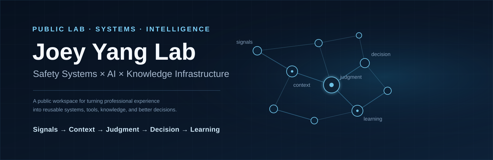
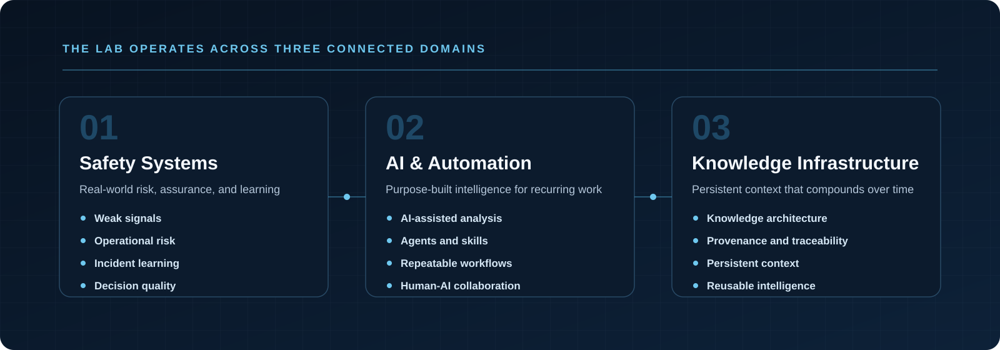
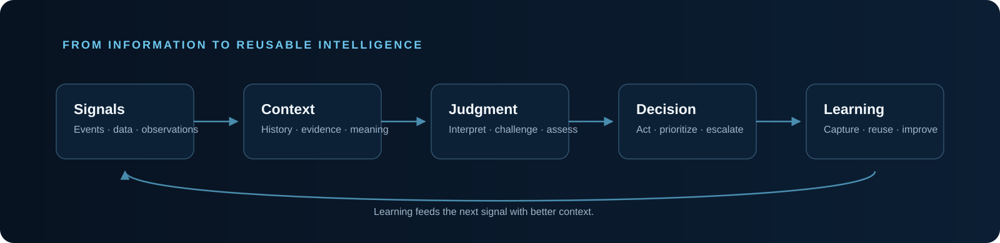
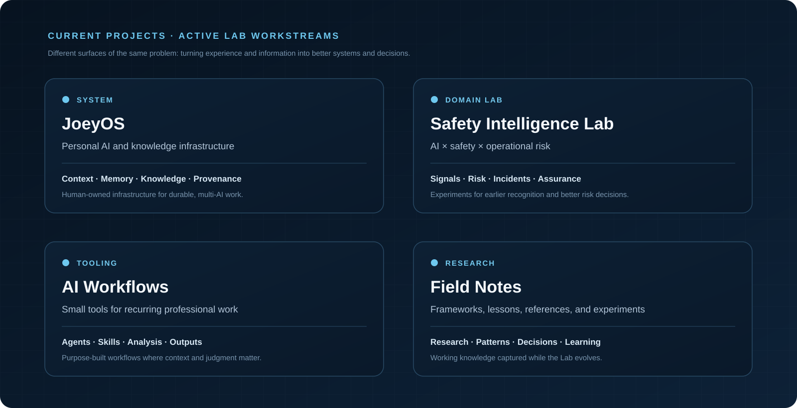

 

**Safety professional exploring how AI, systems thinking, and knowledge infrastructure can improve real-world judgment.**

`Safety Systems` · `Operational Risk` · `AI` · `Knowledge Systems`

---

## Why Joey Yang Lab Exists

Most professional knowledge is fragmented across meetings, documents, incidents, audits, projects, and individual experience.

The problem is rarely a lack of information.

The harder problem is turning that information into **context, judgment, decisions, and learning that can be reused**.

**Joey Yang Lab** is my public workspace for exploring that problem across three connected domains:

> **The goal is not automation for its own sake. The goal is better judgment, earlier risk recognition, and learning that compounds.**

---

## 🧠 What I'm Building

### JoeyOS

An AI-native personal knowledge operating system designed to become a persistent context and intelligence layer across tools, models, and time.

**Capture → Distill → Connect → Reason → Create → Evolve**

JoeyOS explores how a human-owned knowledge system can remain useful even as AI models, interfaces, and tools continue to change.

---

### 🛡️ Safety Intelligence

Exploring how AI can strengthen real-world safety and operational risk management through:

- weak-signal detection
- risk triage and prioritization
- incident and near-miss learning
- audit intelligence
- decision traceability
- organizational learning

The central question is:

> **Can we recognize risk earlier by connecting signals that traditional systems often leave fragmented?**

---

### ⚙️ AI Workflows

Building small, purpose-built tools, agents, skills, and workflows that improve professional judgment rather than simply automate work.

The focus is on recurring work where **context and domain judgment matter**:

**raw information → structured analysis → decision support → reusable output**

---

## 🔬 Questions I'm Exploring

**Can AI identify weak signals before they become incidents?**

**How can organizational experience become reusable intelligence instead of forgotten documents?**

**How should humans and AI work together when professional judgment matters?**

**What should a personal knowledge system look like when AI becomes a permanent collaborator?**

**How can small, purpose-built tools create more value than generic automation?**

---

## 🧭 Working Philosophy

> **Observe the signal. Preserve the context. Improve the decision. Capture the learning.**

I believe useful technology should improve **clarity, judgment, traceability, and learning** — not simply help us do more things faster.

A good system should help answer:

**What happened? → Why does it matter? → What should we do? → What did we learn? → How do we reuse it?**

---

## 🚧 Current Projects

These are the Lab's current workstreams:

**JoeyOS** — Personal AI and knowledge infrastructure focused on persistent context, human-owned knowledge, and multi-AI collaboration.

**Safety Intelligence Lab** — Applied exploration of weak signals, operational risk, incident learning, assurance, and decision quality.

**AI Workflows** — Small, purpose-built tools, agents, skills, and repeatable workflows for professional knowledge work.

**Field Notes** — Research notes, frameworks, lessons, experiments, and ideas captured while building the Lab.

---

### Joey Yang Lab

**Building safer systems. Thinking across disciplines. Turning experience into intelligence.**

